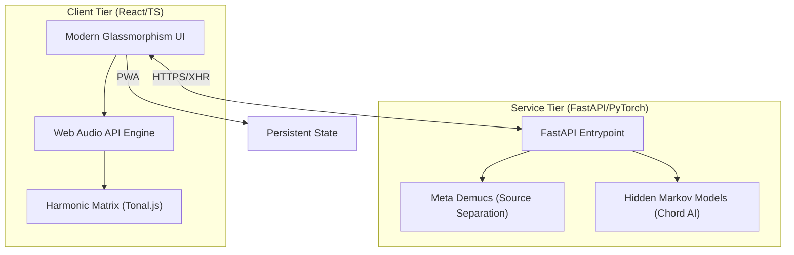

<div align="center">
  

  <br />

  <h1>🎸 Guitariz Studio</h1>
  <p><em>The Next-Generation Digital Workbench for Modern Musicians</em></p>

  <p align="center">
    
    
    
    
    
  </p>

  <p align="center">
    <a href="#-quick-start">Quick Start</a> •
    <a href="#-core-architecture">Architecture</a> •
    <a href="#-features">Features</a> •
    <a href="#-deployment">Deployment</a> •
    <a href="https://guitariz.studio">Live Studio</a>
  </p>
</div>

---

## 📖 Introduction

**Guitariz Studio** is a sophisticated, full-stack ecosystem designed for musicians who demand professional-grade tools within a web-based environment. By combining an ultra-low-latency instrument sandbox with cutting-edge AI for source separation and harmonic detection, Guitariz empowers songwriters and theorists to dissect, analyze, and create with unprecedented clarity.

---

## ⚡ Core Architecture

Guitariz is engineered for performance and scalability, utilizing a decoupled architecture that separates high-frequency UI interactions from intensive AI computations.



---

## 🌟 Features

### 🎹 High-Fidelity Instrument Engine
*   **Virtual Fretboard**: 24-fret guitar simulation with real-time interval labeling and custom tuning support.
*   **Piano Matrix**: 88-key responsive keyboard featuring polyphonic MIDI-style playback.
*   **Tactile Controls**: Comprehensive QWERTY mapping for fluid, instrument-like input.

### 🔬 AI Harmonic Laboratory
*   **Source Separation**: Isolate vocals, bass, and drums from any track using industry-standard **Demucs** models.
*   **Intelligent Chord AI**: Automated harmonic analysis providing a time-synced chord progression from raw audio.
*   **Live Waveform Analysis**: High-precision Peak-detection and visualization for detailed audio study.

### 🎼 Music Theory Toolkit
*   **Modal Explorer**: Visualize Western and Eastern modal systems across the circle of fifths.
*   **Precision Metronome**: Sample-accurate pulse engine with tap-tempo and complex signature support.
*   **Interactive Theory Maps**: Real-time visualization of harmonic relationships as you play.

---

## 🚀 Quick Start

### 1. Developer Environment (Frontend)
Ensure you have Node.js 18+ and npm installed.

```bash
# Clone the repository
git clone https://github.com/abhi9vaidya/guitariz.git
cd guitariz

# Install & Run
npm install
npm run dev
```

### 2. AI Intelligence Layer (Backend)
Required for source separation and ML chord detection.

```bash
cd backend
python -m venv .venv
# Windows: .venv/Scripts/activate | MacOS: source .venv/bin/activate
pip install -r requirements.txt
python main.py
```

---

## � Project Structure

| Directory | Responsibility |
| :-- | :-- |
| `src/components/` | Reusable React components & UI Atomic units. |
| `src/hooks/` | Custom hooks for Audio Context & State Management. |
| `src/lib/` | Core logic for harmonic analysis and audio processing. |
| `backend/` | Python-based AI microservice and ML models. |
| `public/` | Static assets, icons, and PWA manifests. |

---

## �️ Tech Stack & Standards

*   **Design**: Glassmorphism, Tailwind CSS, shadcn/ui.
*   **State**: React Hooks, Context API.
*   **Audio**: Web Audio API (Client side), Librosa (Server side).
*   **ML**: PyTorch, Meta Demucs, Hidden Markov Models.
*   **Quality**: ESLint v9, TypeScript 5.8, Vitest for Unit Testing.

---

## 🤝 Community & Contributing

Guitariz is an open-source project and thrives on community feedback.

1.  **Fork** the project.
2.  Create your **Feature Branch** (`git checkout -b feature/NewInstrument`).
3.  **Commit** your changes (`git commit -m 'feat: Add Cello support'`).
4.  **Push** to the branch (`git push origin feature/NewInstrument`).
5.  Open a **Pull Request**.

---

## � License & Author

Distributed under the **MIT License**. Created and maintained by **Abhinav Vaidya**.

<div align="center">
  <p><b>Guitariz Studio — Harmonizing Technology & Music.</b></p>
  <a href="https://github.com/abhi9vaidya">GitHub</a> • 
  <a href="https://guitariz.studio">Website</a> • 
  <a href="mailto:guitariz.studio@gmail.com">Contact</a>
</div>
