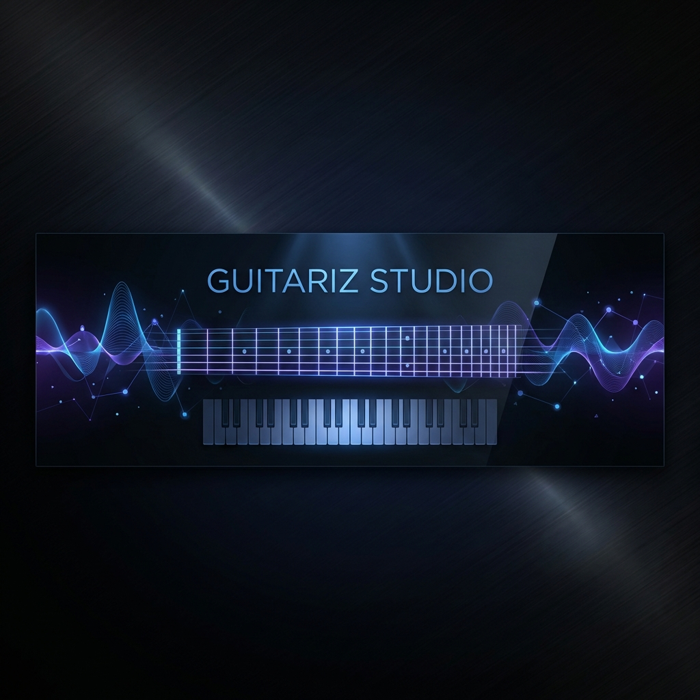
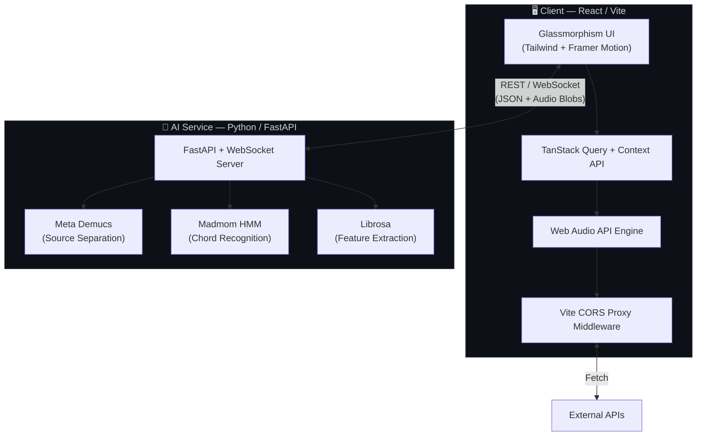

<div align="center">
  

  <br />

  <h1>🎸 Guitariz Studio</h1>
  <p><strong>The Open-Source Digital Workbench for Modern Musicians</strong></p>
  <p><em>AI-powered chord detection · Stem isolation · Interactive theory tools · All in one place.</em></p>

  <br />

  <p>
    
    <a href="LICENSE"></a>
    
    <a href="https://guitariz.studio"></a>
  </p>
  <p>
    
    
    
    
    
    
  </p>

  <p>
    <a href="https://guitariz.studio">🌐 Live Demo</a> · 
    <a href="https://github.com/Guitariz/Guitariz/issues/new?template=bug_report.md">🐛 Report Bug</a> · 
    <a href="https://github.com/Guitariz/Guitariz/issues/new?template=feature_request.md">✨ Request Feature</a>
  </p>
</div>

<br />

---

## 📖 About

**Guitariz Studio** is a full-stack, professional-grade music platform that bridges the gap between traditional music theory and modern AI. It brings together AI-powered source separation, real-time chord recognition, interactive instrument simulations, and gamified ear training—all within a single, beautifully crafted web application.

Whether you're a songwriter dissecting harmonies, a student mastering intervals, a producer isolating stems, or a developer pushing the boundaries of music tech—Guitariz is built for you.

> **🎯 Try it now →** [guitariz.studio](https://guitariz.studio)

---

## ✨ Features

### 🤖 Audio Intelligence

| Feature | Description |
|:--|:--|
| **Chord AI** | Upload any audio file and get real-time chord recognition powered by Hidden Markov Models via **Madmom**. |
| **Stem Separator** | Isolate vocals, drums, bass, and other instruments using Meta's state-of-the-art **Demucs** deep learning model. |
| **Vocal Splitter** | One-click vocal extraction for creating instrumentals or acapellas from any track. |
| **Precision Tuner** | Advanced chromatic tuner with cent-level accuracy for guitar, bass, ukulele, and vocals. |

### 🎮 Interactive Learning

| Feature | Description |
|:--|:--|
| **Ear Training Arcade** | Gamified modules for **interval recognition**, **chord identification**, and **perfect pitch** training with streak tracking. |
| **Scale Explorer** | Visualize 50+ Western and Eastern scales across the Circle of Fifths, with modal breakdowns and theory context. |
| **Virtual Fretboard** | Fully interactive 24-fret guitar simulation with real-time interval mapping, note highlighting, and 3D view. |
| **Virtual Piano** | 88-key piano with chord/scale overlays and keyboard shortcut support. |

### 🛠️ Platform & DX

| Feature | Description |
|:--|:--|
| **Progressive Web App** | Fully installable on desktop and mobile with offline-ready service worker support. |
| **Dark-Mode-First UI** | Sleek glassmorphism aesthetic with Framer Motion micro-animations, designed for creative environments. |
| **Configurable Navbar** | Switch between horizontal and vertical navigation layouts to match your workflow. |
| **Metronome** | Professional metronome with adjustable BPM, time signatures, and visual beat indicator. |
| **CI/CD Pipeline** | Automated linting, testing, and build validation via GitHub Actions. |

---

## ⚡ Architecture

Guitariz uses a **hybrid architecture** to balance interactive client-side performance with heavy server-side AI computation.



---

## 📂 Project Structure

```
guitariz/
├── src/
│   ├── components/          # Reusable UI components (Fretboard, Piano, Tuner, etc.)
│   │   ├── ui/              # shadcn/ui primitives (Button, Dialog, Toast, etc.)
│   │   ├── chord-ai/        # Chord AI feature components
│   │   ├── ear-training/    # Ear Training game components
│   │   ├── fretboard/       # Fretboard + 3D view components
│   │   └── piano/           # Virtual Piano components
│   ├── hooks/               # Custom React hooks (audio, WebSocket, PWA, etc.)
│   ├── lib/                 # Core logic — harmonic analysis, audio processing
│   ├── pages/               # Route-level page components
│   └── main.tsx             # Application entrypoint
├── backend/
│   ├── main.py              # FastAPI server + REST endpoints
│   ├── analysis.py          # Audio feature extraction pipeline
│   ├── chord_madmom.py      # Madmom-based chord recognition
│   ├── websocket_chords.py  # Real-time WebSocket chord streaming
│   ├── youtube.py           # YouTube audio download utilities
│   ├── Dockerfile           # Container build for AI service
│   └── requirements.txt     # Python dependencies
├── .github/
│   ├── workflows/ci.yml     # GitHub Actions CI pipeline
│   └── ISSUE_TEMPLATE/      # Bug report & feature request templates
├── public/                  # Static assets, PWA manifest, sitemap
├── vite.config.ts           # Vite config with custom CORS proxy
├── tailwind.config.ts       # Tailwind CSS theme configuration
└── package.json             # Project metadata & scripts
```

---

## 🛠️ Tech Stack

<table>
  <tr>
    <th>Layer</th>
    <th>Technology</th>
  </tr>
  <tr>
    <td><strong>Frontend</strong></td>
    <td>React 18 · TypeScript 5.8 · Vite 5 · React Router 6</td>
  </tr>
  <tr>
    <td><strong>UI</strong></td>
    <td>Tailwind CSS · shadcn/ui · Radix Primitives · Framer Motion · Lucide Icons</td>
  </tr>
  <tr>
    <td><strong>3D</strong></td>
    <td>Three.js · React Three Fiber · Drei</td>
  </tr>
  <tr>
    <td><strong>State</strong></td>
    <td>TanStack Query (React Query) · React Context</td>
  </tr>
  <tr>
    <td><strong>Audio</strong></td>
    <td>Web Audio API · FFT.js (Client) · Librosa (Server)</td>
  </tr>
  <tr>
    <td><strong>AI / ML</strong></td>
    <td>Python · PyTorch · Meta Demucs · Madmom · FastAPI</td>
  </tr>
  <tr>
    <td><strong>Music Theory</strong></td>
    <td>Tonal.js — harmonic matrix, intervals, scales, chords</td>
  </tr>
  <tr>
    <td><strong>Testing</strong></td>
    <td>Vitest · React Testing Library · Ruff (Python linting)</td>
  </tr>
  <tr>
    <td><strong>Infra</strong></td>
    <td>Vercel (Frontend) · Docker (Backend) · GitHub Actions CI · Husky + lint-staged</td>
  </tr>
</table>

---

## 🚀 Getting Started

### Prerequisites

| Tool | Version |
|:--|:--|
| Node.js | `>= 18.0` |
| npm | `>= 9.0` |
| Python *(optional — for AI features)* | `>= 3.10` |

### 1. Clone & Install

```bash
git clone https://github.com/Guitariz/Guitariz.git
cd guitariz
npm install
```

### 2. Configure Environment

```bash
cp .env.example .env.local
```

Edit `.env.local` with your backend URL if running AI features locally.

### 3. Run the Dev Server

```bash
npm run dev
```

The app will be available at **`http://localhost:5173`**.

### 4. Backend Setup *(Optional)*

Required only for **Chord AI**, **Stem Separator**, and **Vocal Splitter** features.

```bash
cd backend

# Create and activate a virtual environment
python -m venv .venv

# Windows
.venv\Scripts\activate
# macOS / Linux
source .venv/bin/activate

# Install dependencies
pip install -r requirements.txt

# Start the FastAPI server
python main.py
```

> **Note:** First launch will download the Demucs model (~300 MB). Subsequent starts are instant.

### Available Scripts

| Command | Description |
|:--|:--|
| `npm run dev` | Start Vite dev server with HMR |
| `npm run build` | Production build |
| `npm run build:prerender` | Build + SEO pre-rendering |
| `npm run lint` | Run ESLint across the codebase |
| `npm run test` | Run Vitest test suite |
| `npm run test:ui` | Run tests with Vitest UI |
| `npm run preview` | Preview the production build locally |

---

## 🤝 Contributing

Contributions are what make the open-source community such an incredible place to learn, inspire, and create. **Any contributions you make are greatly appreciated.**

Please read the [**Contributing Guide**](CONTRIBUTING.md) and our [**Code of Conduct**](CODE_OF_CONDUCT.md) before getting started.

```
1. Fork the repository
2. Create your feature branch    →  git checkout -b feature/amazing-feature
3. Commit your changes           →  git commit -m 'feat: add amazing feature'
4. Push to the branch            →  git push origin feature/amazing-feature
5. Open a Pull Request
```

Looking for a place to start? Check out issues tagged [`good first issue`](https://github.com/abhi9vaidya/guitariz/labels/good%20first%20issue) or [`help wanted`](https://github.com/abhi9vaidya/guitariz/labels/help%20wanted).

---

## 🗺️ Roadmap

- [ ] Real-time YouTube audio chord analysis
- [ ] MIDI export from Chord AI detections
- [ ] Collaborative jam rooms via WebRTC
- [ ] Mobile-native app (React Native / Capacitor)
- [ ] Additional instrument support (Ukulele, Bass tablature)
- [ ] User accounts with progress tracking

> See the [open issues](https://github.com/abhi9vaidya/guitariz/issues) for a full list of proposed features and known issues.

---

## 🎖️ Acknowledgements

Guitariz Studio stands on the shoulders of giants in the Music Information Retrieval (MIR) community. Special thanks to the authors of these pivotal libraries:

- **[Meta Demucs](https://github.com/facebookresearch/demucs)** — State-of-the-art deep learning source separation powering our Stem Separator.
- **[Madmom](https://github.com/CPJKU/madmom)** — High-performance Hidden Markov Model implementations for chord recognition.
- **[Librosa](https://librosa.org/)** — The backbone of server-side audio analysis and feature extraction.
- **[Tonal.js](https://github.com/tonaljs/tonal)** — Comprehensive music theory library for client-side harmonic analysis.
- **[shadcn/ui](https://ui.shadcn.com/)** — Beautiful, accessible component primitives built on Radix UI.

---

## 📜 License

Distributed under the **MIT License**. See [`LICENSE`](LICENSE) for more information.

---

<div align="center">

  **Guitariz Studio — Harmonizing Technology & Music.**

  <br />

  <a href="https://guitariz.studio">Website</a> · 
  <a href="https://github.com/abhi9vaidya/guitariz">GitHub</a> · 
  <a href="https://x.com/GuitarizStudio">Twitter</a> · 
  <a href="mailto:guitariz.studio@gmail.com">Contact</a>

  <br />
  <br />

  <sub>Built with ❤️ by <a href="https://github.com/abhi9vaidya">Abhinav Vaidya</a></sub>

  <br />

  <a href="#-guitariz-studio"></a>

</div>
